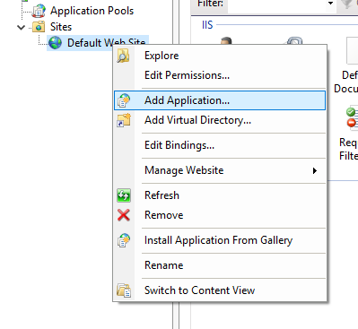

# Setup and Configuring on IIS 

## Prerequisites
* Internet Information Services (IIS) enabled     

Since Windows 7 the IIS is available in the Operating System and needs to be enabled via Programs and Features

Newer Windows:
> Open Start Menu > Type Search: Turn Windows Features on or off


or 

1. Open the "Control Panel"
   
2. "Programs and Feature" -> "Turn Window features on or off".

Then enable the "Internet Information Services" Feature


Ensure to also enable ASP.NET 4 applications


**Benefits of IIS Hosting**

* The Web Service is deployed, managed and monitored like other IIS applications.
  * The IIS gets regularly Security Updates by Microsoft, 
  * HTTP(s) settings are maintained in IIS
  * Port and Upload sizes
* It can provide the process activation and recycling capabilities that increase the reliability of the hosted application.
* It simplifies the development and deployment of hosted services.

### Setup Hosting in IIS

Create an initial Publish Profile for the WebService.
The profile will copy the needed runtime environment into a dedicated Folder


For an easy example just use Folder publish, select a destination an continue


This will initiate a first Publish into the selected destination location

open the Internet Information Services (IIS) Manager and add a new Application to the 
"Default Web Site"



Define an Alias under which the Application will be available and point the physical path to 
the selected publish destination folder


Now you can navigate to
>http://localhost/VsGallery/feeds/atom.xml


## How it works

All of the hosting configuration can be done in IIS Manager or directly in web.config.

To change the Port from default :80 to e.g. 5100, select the "Default Web Site" in Connections Pane
and click "Bindings..." in Action Pane on the Right
Select existing Binding and change Port via Edit. 
HTTPS can be configured here as well.

The Gallery Settings like Storage location and some Gallery Configuration can be done directly in web.config:

```
    <VsGallerySettings>
        <Storage VsixStorageDirectory="~/App_Data/VsixStorage" UploadDirectory="~/App_Data/VsixUploads" />
        <Gallery Guid="54F7969C-F561-4B16-9D6B-7325EDE0A3C1" Title="Super Productive Gallery" TrackDownloads="True" TrackRatings="True" />
    </VsGallerySettings>
```

the `~` in the derectory configuration means Web Application root directory.

To require a key to upload packages set the `UploadKey` for the gallery

```
    <VsGallerySettings>
        <Storage VsixStorageDirectory="~/App_Data/VsixStorage" UploadDirectory="~/App_Data/VsixUploads" />
        <Gallery Guid="54F7969C-F561-4B16-9D6B-7325EDE0A3C1" Title="Super Productive Gallery" TrackDownloads="True" TrackRatings="True" UploadKey="nXqjCmD5t6xr5nFEKZ3UgONQWUZYJf9G" />
    </VsGallerySettings>
```

The default local physical structure
 `.vsix` files, along with their download counts and ratings data are stored in a subfolder of the main service executable `VsixStorage/` (this subfolder is configurable). This makes taking backups and moving the service between machines super easy as the root folder contains the entire Microservice state and data.

Default Layout:
<pre>
root-folder
  |--bin
    |--"Binaries"
  |--web.config
  |--App_Data
    |--VsixUploads
    |--VsixStorage
      |--atom.xml
      |--First.vsix
      |--Second.vsix
      |--AndSoForth.vsix

</pre>


## Further Links
* [More IIS Details @Microsoft](https://docs.microsoft.com/en-us/iis/install/installing-iis-7/install-typical-iis-workloads)